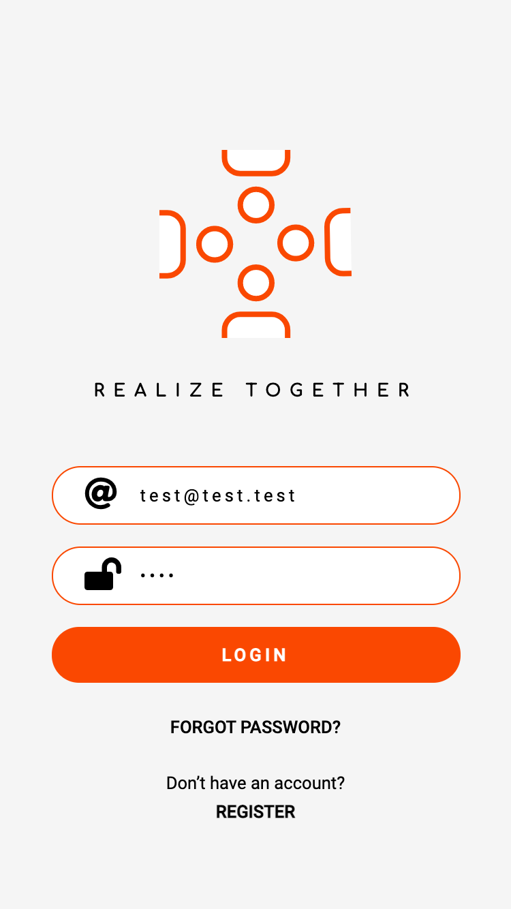
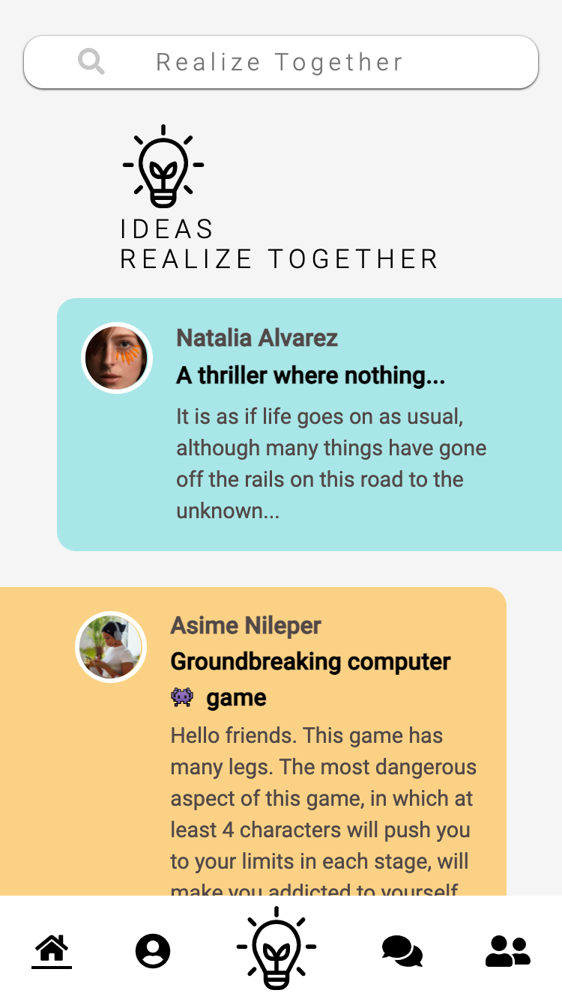

# Realize Together

You have an idea or even a specific project idea in mind, but don't know what to do with it! Or do you need help? Do you want to realize your idea with other like-minded people? Then register today at "Realize Together" and find your project partners and realize your ideas together. We can do it!

This is a progressive web APP, which is still a prototype. This is a social platform where people can share their ideas, especially project ideas, with one another and realize them together. A case study: Suppose you have a project idea in mind. You want to make a movie. You can write scripts yourself, but you don't know anything about filming, and you don't know a single person who works in the film industry. So, you are looking for partners who can produce your film with you. You register with "Realize Together", create a profile and share your project idea with the others, in this case, e.g. producers, directors or scriptwriters like you, will reach out to you. In this way, you get to know people who want to work with you and who want to realize their ideas, just like you.

### Demo




#### Here you can view and test the app:

[Realize Together](https://realizetogether.herokuapp.com/)

## Installing / Getting started

In the project directory, you can run:

```shell
npm install
npm start
```

Runs the server in production mode and serve production bundle from npm run build

```shell
npm run dev:client
```

Runs the app in development mode. Open http://localhost:3000 (default PORT) to view it in the browser.
The page will automatically reload if you make changes to the code. You will see the build errors and lint warnings in the console.

```shell
npm run dev:server
```

Runs the server in development mode.

```shell
npm run build
```

Run storybook.

```shell
npm run storybook
```

## Developing

### Built With

 [React](https://reactjs.org/)

### Tech Stack

- [HTML5](https://developer.mozilla.org/en-US/docs/Glossary/HTML5)
- [CSS3](https://developer.mozilla.org/en-US/docs/Web/CSS)
- [JavaScript](https://developer.mozilla.org/en-US/docs/Web/JavaScript)
- [TypeScript](https://www.typescriptlang.org/)
- [React](https://reactjs.org/)
- [React Hooks](https://reactjs.org/docs/hooks-intro.html)
- [React Router](https://reactrouter.com/)
- [MongoDB](https://www.mongodb.com/)
- [Express.js](http://expressjs.com/)
- [Node.js](https://nodejs.org)
- [Storybook](https://storybook.js.org/)
- [Heroku](https://www.heroku.com)
- [dotenv](https://github.com/motdotla/dotenv)
- [node-fetch](https://github.com/node-fetch/node-fetch)
- [JEST](https://jestjs.io/)
- [Prettier](https://prettier.io/)
- [ESLint](https://eslint.org/)
- [Husky](https://github.com/typicode/husky)
- [Lint-Staged](https://github.com/okonet/lint-staged)
- [Adobe XD](https://www.adobe.com/products/xd.html)
